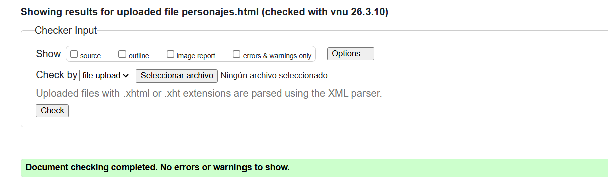
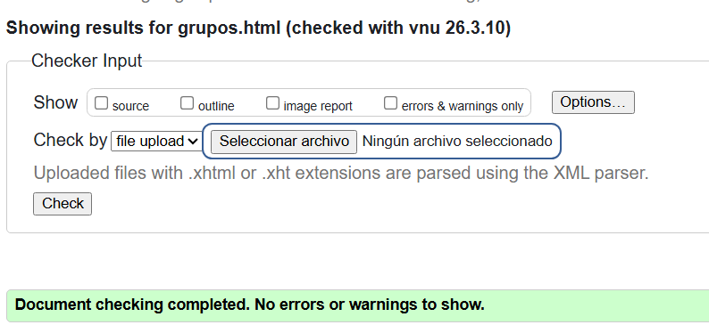
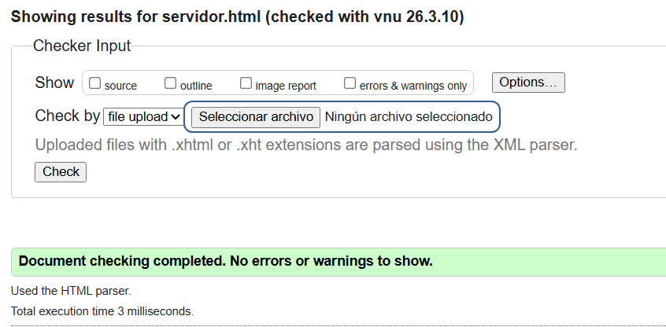
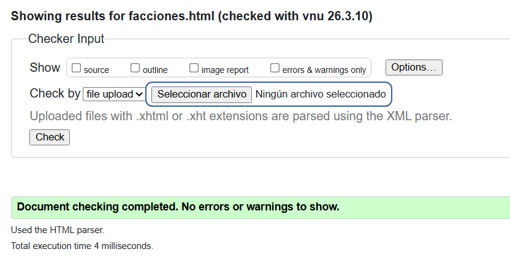
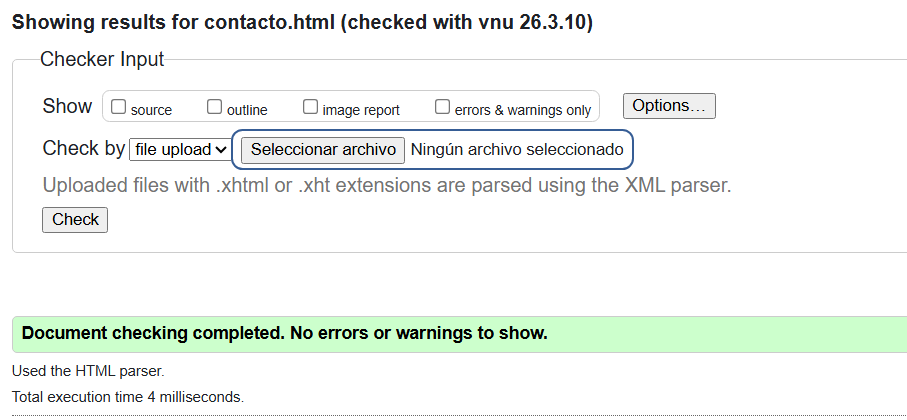
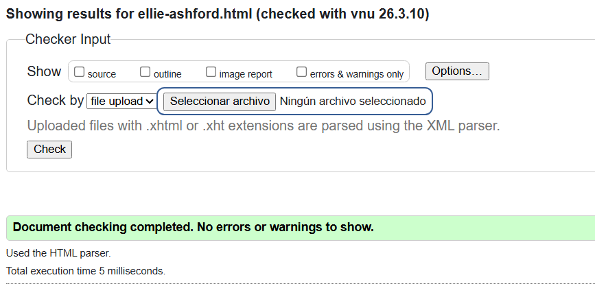
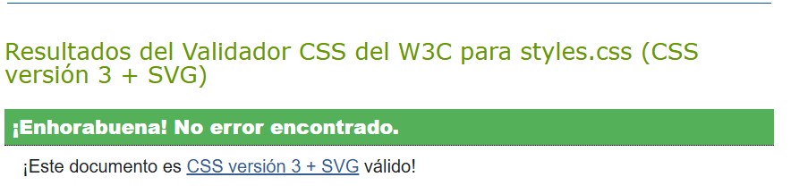

# WikiRP2
## Datos del alumno
- Nombre: Antonio Jesús Mora Cabeza
- Curso: 1º DAW A
- Correo: nmorcab2106@g.educaand.es

## Fase 1
### Capturas W3C
- Index

- Personajes

- Grupos

- Servidor

- Facciones

- Contacto

- Ellie Ashford

### Decisiones tomadas
- En la página de contacto, apenas aparecen cosas en un principio ya que se quieren añadir con JS, al darle a cada boton de radio se mostrará una información u otra.

- Lá página de Ellie Ashford es para mostrar tablas y demás

- Las páginas a revisar son:
    - [index.html](index.html)
    - [servidor.html](servidor.html)
    - [personajes.html](personajes.html)
    - [ellie-ashford.html](personajes/ellie-ashford.html)
    - [grupos.html](grupos.html)
    - [facciones.html](facciones.html)
    - [contacto.html](contacto.html)

    Las demás páginas no han podido ser terminadas pero estás muestran todo o casi todo lo pedido.

## Fase 2
### Validacion de css

